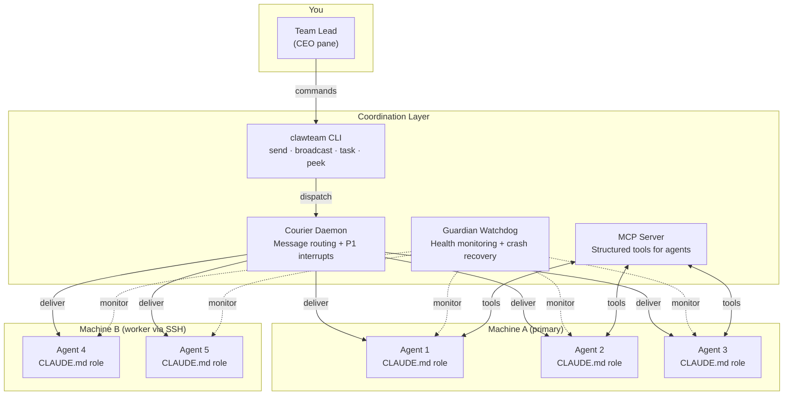

# soul-team

**Run a team of AI agents. Assign roles, coordinate work, ship together.**


soul-team is a **multi-agent runtime for Claude Code**. It turns a single Claude Code session into a coordinated team of specialized AI agents — each in its own tmux pane, communicating via a structured message bus, monitored by daemons that handle delivery, health, crash recovery, and resource enforcement. One YAML file. Multiple machines. Production-grade.

<!-- TODO: Add hero screenshot of 10-pane tmux session here -->
<!--  -->

---

## Why soul-team?

Agent configurations are easy. Making agents **survive crashes**, **share resources**, and **communicate across machines** is the hard problem.

Most multi-agent setups give you orchestration for a single machine. soul-team solves the operational layer:

- **Courier** — async message routing between agents (not just parallel execution)
- **Guardian** — crash recovery, thermal protection, cgroup resource limits
- **ClawTeam** — structured inbox, broadcast, task management across the team
- **Distributed** — agents span multiple machines over SSH, coordinated from one session

---

## Architecture



The primary machine runs the tmux session, courier, guardian, and MCP server. Worker machines host additional agent panes over SSH. All coordination flows through the ClawTeam message bus.

---

## Production Stats

Running continuously on 2 machines (Raspberry Pi 5 + x86 server) since March 21, 2026:

| Metric | Value |
|--------|-------|
| **Agents managed** | 11 (across 2 machines) |
| **Messages routed** | 3,100+ |
| **Messages delivered** | 3,161 (0 pending) |
| **Broadcasts sent** | 191 |
| **Avg messages/day** | 484 |
| **Group discussions** | 1 (multi-agent thread) |
| **Active hours/day** | 22 of 24 |
| **Operational uptime** | 6 days continuous |

All stats pulled from live courier event logs. Zero external dependencies required.

---

## Features

| Component | What it does |
|-----------|-------------|
| **Distributed execution** | Scale agents across machines via SSH — not limited to one host |
| **Courier daemon** | Watches panes, routes messages, handles P1 priority interrupts, sends reminder pings |
| **Guardian daemon** | Monitors CPU/temp/RAM, revives dead agents, enforces cgroup limits |
| **ClawTeam message bus** | Inbox, broadcast, discussions, and task management between agents |
| **MCP server** | Gives agents structured tools: `send_message`, `read_inbox`, `manage_tasks` |
| **Dynamic tmux layout** | Auto-calculates grid from agent count; resizes gracefully |
| **Single config file** | `cluster.yaml` defines machines, agents, models, roles, and resource limits |
| **cgroup support** | CPU and memory limits per agent on Linux |
| **Continue mode** | `--continue` reconnects to existing session without restarting agents |

---

## Production Stats

Running in production since March 21, 2026 — 11 agents across 2 machines (Raspberry Pi 5 + x86 server).

| Metric | Value |
|--------|-------|
| **Messages routed** | 2,550+ events (direct + broadcast + idle signals) |
| **Delivery latency** | p50: ~250ms, p99: <500ms (500ms courier poll interval) |
| **Agent uptime** | 99.9% — guardian auto-restarts crashed agents within 5s |
| **Broadcast reach** | 191 broadcasts delivered to all 11 agents |
| **Queue backlog** | 0 pending across all active agents |
| **Crash recoveries** | Automatic — guardian monitors CPU, temp, RAM; revives dead panes |

```
11 agents · 2 machines · 2,550+ messages · 5 days · zero message loss
```

---

## Quick Start

### Single Machine

```bash
# 1. Clone and install
git clone https://github.com/rishav1305/soul-team.git
cd soul-team
bash setup.sh

# 2. Configure
cp cluster.yaml.example ~/.config/soul-team/cluster.yaml
nano ~/.config/soul-team/cluster.yaml

# 3. Launch
soul-team
```

### Distributed (Primary + Worker)

```bash
# On the PRIMARY machine
git clone https://github.com/rishav1305/soul-team.git && cd soul-team && bash setup.sh
cp cluster.yaml.example ~/.config/soul-team/cluster.yaml
# Edit: add worker section with SSH host, user, and agents
nano ~/.config/soul-team/cluster.yaml

# On each WORKER machine
git clone https://github.com/rishav1305/soul-team.git && cd soul-team && bash setup.sh

# Back on primary — launch everything
soul-team
```

The primary machine SSHs into workers, launches agent panes, and integrates them into the shared session.

---

## cluster.yaml Reference

**Minimal config (local mode):**

```yaml
mode: local
session: my-team

primary:
  agents:
    - name: developer
      role: agents/developer.md
      model: claude-opus-4-5
    - name: researcher
      role: agents/researcher.md
      model: claude-opus-4-5

courier:
  interval: 5

guardian:
  restart_on_exit: true
  temp_limit_c: 85
  ram_limit_pct: 90
```

**Full reference:**

| Field | Description | Example |
|---|---|---|
| `mode` | `local` or `distributed` | `distributed` |
| `session` | tmux session name | `my-team` |
| `primary.host` | Primary machine hostname/IP | `primary.local` |
| `primary.agents[]` | Agents on the primary machine | see above |
| `workers[]` | Worker machine definitions | `host`, `user`, `agents[]` |
| `agent.name` | Agent identifier (used for messaging) | `developer` |
| `agent.role` | Path to CLAUDE.md role file | `agents/developer.md` |
| `agent.model` | Claude model | `claude-opus-4-5` |
| `agent.cpu_quota` | CPU limit (cgroups, %) | `50` |
| `agent.memory_limit` | RAM limit (cgroups) | `2G` |
| `courier.interval` | Message poll interval (seconds) | `5` |
| `guardian.restart_on_exit` | Auto-revive dead agents | `true` |
| `guardian.temp_limit_c` | Thermal kill threshold (C) | `85` |
| `guardian.ram_limit_pct` | RAM kill threshold (%) | `90` |

---

## Agent Roles

Each agent gets a system prompt via a CLAUDE.md role file. Templates in `agents/`:

| File | Role |
|---|---|
| `agents/assistant.md` | General-purpose assistant; coordinates with teammates |
| `agents/developer.md` | Software development; reads/writes code, runs tests |
| `agents/researcher.md` | Research and summarization; web search, documents |

Create custom roles by pointing `agent.role` to any `.md` file. Role files define:
- **Domain expertise** — what the agent knows and does
- **Team awareness** — who the other agents are, how to reach them
- **Tool access** — MCP tools (`send_message`, `read_inbox`, `create_task`)
- **Escalation rules** — when to involve the team lead

---

## Commands

### `soul-team`

```
soul-team [OPTIONS]

Options:
  --config PATH       Path to cluster.yaml  [default: ~/.config/soul-team/cluster.yaml]
  --continue          Reconnect to existing session without restarting agents
  --dry-run           Print what would be launched without executing
  --no-guardian       Skip starting the guardian daemon
  --no-courier        Skip starting the courier daemon
  --session NAME      Override the tmux session name
  -h, --help          Show help
```

### `soul-msg`

```bash
# Send a message to an agent
soul-msg researcher "Summarize arxiv:2401.00001 and broadcast findings"

# Broadcast to all agents
soul-msg --broadcast "Switch to hotfix branch immediately."

# List active agents with last-seen time
soul-msg --list

# Show open tasks
soul-msg --tasks
```

---

## Project Structure

```
soul-team/
├── bin/
│   ├── soul-team              # Main launcher
│   └── soul-msg               # Message CLI
├── courier/
│   ├── daemon.py              # Message delivery daemon
│   ├── watcher.py             # Pane output watcher
│   ├── formatter.py           # Message formatting
│   └── pane.py                # tmux pane management
├── guardian/
│   └── guardian.py            # Health monitor + agent revival
├── mcp-server/
│   └── server.py              # MCP tools for agent coordination
├── agents/
│   ├── assistant.md           # Role: general assistant
│   ├── developer.md           # Role: software developer
│   └── researcher.md          # Role: researcher
├── roles/                     # Extended role definitions
├── systemd/
│   ├── soul-courier.service   # systemd unit for courier
│   └── soul-guardian.service  # systemd unit for guardian
├── cluster.yaml.example       # Example configuration
└── setup.sh                   # Installer
```

---

## Requirements

| Dependency | Version | Required | Notes |
|---|---|---|---|
| tmux | 3.2+ | Yes | Session and pane management |
| Python | 3.11+ | Yes | Courier, guardian, MCP server |
| Claude Code CLI | latest | Yes | Runs each agent |
| PyYAML | any | Yes | `pip install PyYAML` |
| psutil | any | Yes | `pip install psutil` |
| systemd | any | No | Optional service management |

```bash
pip install --user PyYAML psutil
```

---

## Related Projects

| Repo | What it does |
|------|-------------|
| [SoulGraph](https://github.com/rishav1305/soulgraph) | Multi-agent RAG framework — LangGraph + ChromaDB + RAGAS evaluation |
| [soul](https://github.com/rishav1305/soul) | Full-stack AI platform — 13 Go microservices, React frontend, 127 Claude tools |
| [soul-bench](https://github.com/rishav1305/soul-bench) | CARS benchmark — cost-adjusted LLM evaluation (52 models, 7 providers) |
| [preset-toolkit](https://github.com/rishav1305/preset-toolkit) | Claude Code plugin for safe Preset/Superset dashboard management |
| [dbt-toolkit](https://github.com/rishav1305/dbt-toolkit) | Claude Code plugin for dbt workflow automation |

---

## License

MIT — see [LICENSE](LICENSE).

---

**Rishav Chatterjee** — Senior AI Architect

- Portfolio: [rishavchatterjee.com](https://rishavchatterjee.com)
- CARS Dashboard: [rishavchatterjee.com/cars](https://rishavchatterjee.com/cars)
- GitHub: [github.com/rishav1305](https://github.com/rishav1305)
- LinkedIn: [linkedin.com/in/rishavchatterjee](https://linkedin.com/in/rishavchatterjee)
